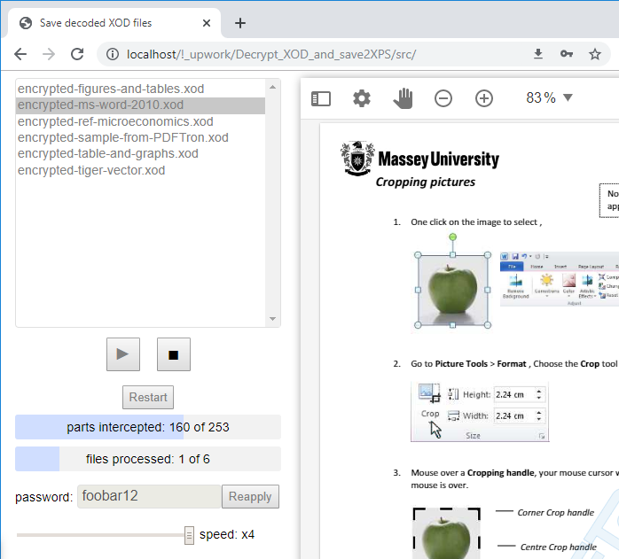

# XOD2XPS decryption
XOD to XPS decryption: decrypts Open XML Documents encrypted by PDFTron and save them to XPS format

## Overview
This is an SPA that can be hosted on any web-server. It decrypts Open XML Documents and save them to XPS format according to ECMA-388 specification (XOD to XPS decryption). Only files encrypted by PDFTron are supported.
You can contact me to get a newer version of XOD2XPS-decryption with significantly improved performance and bug fixing when some files processing lead to an endless loop

## Table of contents
- [Overview](#Overview)
- [Description](#Description)
  - [The problem](#The-problem)
  - [Goals](#Goals)
  - [Tasks](#Tasks)
  - [Solutions](#Solutions)
- [Dependencies](#Dependencies)
- [Requirements](#Requirements)
- [Deployment](#Deployment)
- [Usage](#Usage)
  - [Usage restrictions](#Usage-restrictions)
- [Video](#Video)
- [Contributing](#Contributing)
- [Communication](#Communication)
- [Credits](#Credits)
- [License](#License)

## Description
### The problem
XOD files (Open XML Documents) can be encrypted at conversion time and PDFTron WebViewer can view these documents when supplied with the password. This is a one of certain forms of DRM which restricts users to only be able to view documents inside the viewer and not simply download the files to view any time outside of it.
According to the DRM ideology, there is neither function in PDFTron library to decrypt whole XOD file nor save decrypted parts into a single file. The only way to save document is the print function which can save all page canvases as images on a  virtual PDF/XPS printer without any text inside and without the possibility of text search

### Goals
Decrypt XOD files and download them as XPS files to view any time outside of PDFTron WebView interface. Decrypted and saved files should contain graphics and text in the same resolution and location as the original encrypted files and text should be the same, accurate and searchable

### Tasks
- Decrypt XOD files
- Convert decrypted files to XPS format
- Save XPS files in local storage

### Solutions
- Injecting Javascript code in a PDFTron Webview instance to intercept decrypted parts
- Scrolling all pages in an opened document to load and decrypt all parts by PDFTron Webview instance
- Assembling intercepted decrypted parts to XPS file according to ECMA-388 specification
- Sending XPS file to user by "save as" dialog 
    
## Dependencies
None. The code is written in vanilla JavaScript

## Requirements
- Web Browser: Google Chrome v.77 (other browsers are not tested)
- Free RAM: .5 - 1.5 GB (depending on document size) with a working web browser
- Web server: any, server-side scripts are not used.

## Deployment
1. Unzip archive and copy all content in `XOD2XPS-decryption` folder anywhere under your web-server document root folder.
2. Copy (do not move) `./XOD2XPS-decryption/lib` folder to web-server document root folder: `DOMAIN_NAME/lib`, this path is hardcoded in PDFTron library

## Usage
- To run the web-application, just follow the path where it is located : `any_domain_name/path-to-XOD2XPS-decryption-content/index.html`
- Follow the instructions in web-application
 
### Usage restrictions
- Only encrypted files are supported
- Only PDFTron encryption is supported

## Video
You can view how this application work in [this video](https://youtu.be/ZQOKGyjnfWU)

## Contributing
Thanks for taking the time to start contributing!

I'd love to accept your suggestions and patches to make this project better and more useful.

As a potential contributor, your changes and ideas are welcome at any hour of the day or night, weekdays, weekends, and holidays. Please do not ever hesitate to ask a question or send a pull request.
If you have any questions or suggestions or any problem with this project, please [file an issue](https://github.com/Nickieros/HXOD2XPS-decryption/issues).

This project accepts contribution via github [pull requests](https://help.github.com/articles/about-pull-requests/). This document outlines the process to help get your contribution accepted.

Please remember to read and observe the [Code of Conduct](https://github.com/cncf/foundation/blob/master/code-of-conduct.md).

## Communication
If you have any questions or suggestions for this project, please [file an issue](https://github.com/Nickieros/XOD2XPS-decryption/issues). For other questions [contact me](https://github.com/Nickieros).

## Credits
2019 [Nickieros](https://github.com/Nickieros)

## License
MIT
